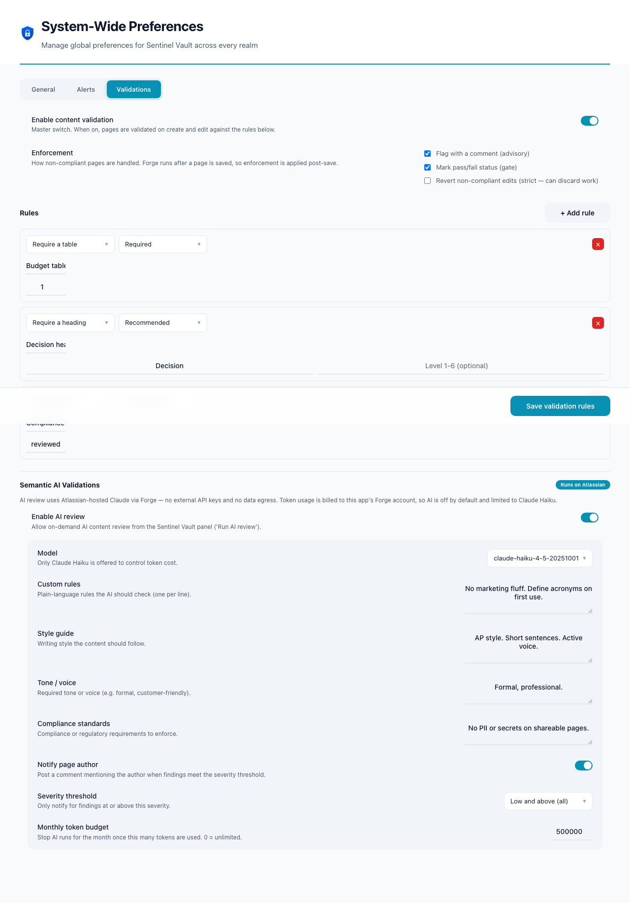
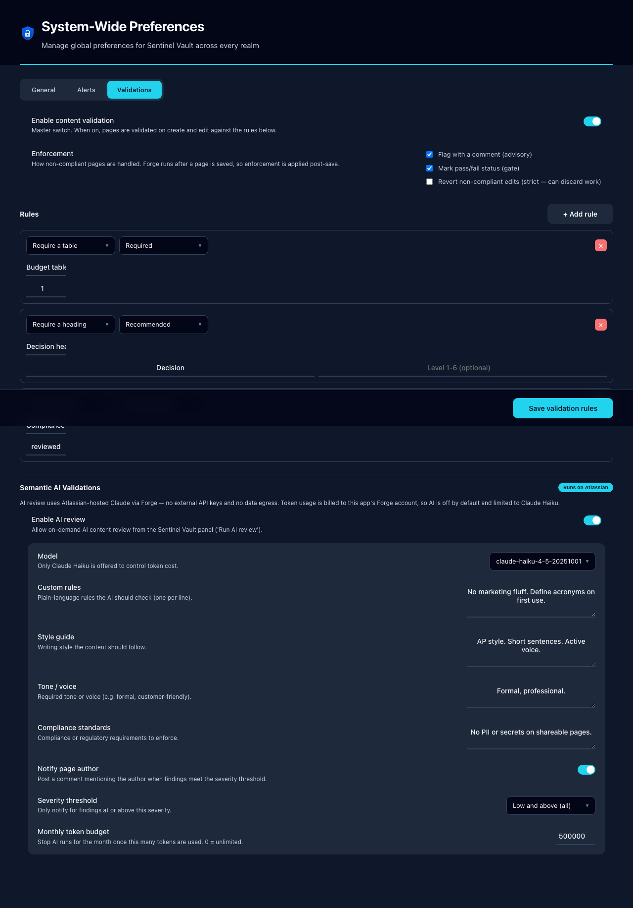
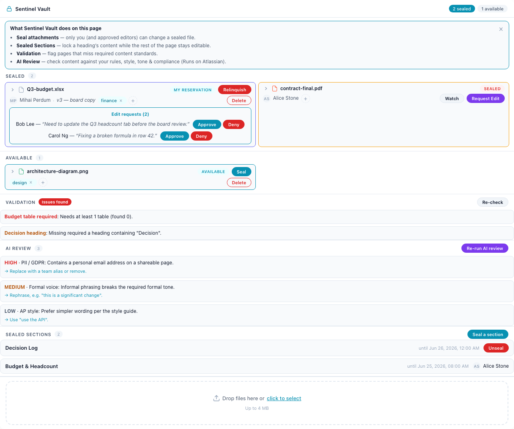

# Conditions & Validations

> Define rules that Confluence pages are checked against on create and edit — required fields, formatting, approval gates — and enforce them.

| | |
|---|---|
| **Surfaces** | Steward console → *Validations* tab (authoring) · Inline panel → *Validation* (reporting) |
| **Who can use it** | Admins/stewards author rules; everyone is validated |
| **Status** | Shipped in v4.0.0 |
| **Runs on Atlassian** | Yes (no external egress) |

## What it does

Pages are validated against admin-configured rules — required headings, required tables, required labels, heading hierarchy, and length limits. Because Forge page events fire **after** a save (it cannot block a pre-publish save), enforcement is applied post-save in one of three selectable modes:

- **Advisory** — post a footer comment listing the issues (no content change). *Highest confidence; recommended default.*
- **Approval gate** — stamp a pass/fail/awaiting-approval status that the panel and ribbon display; a steward can approve.
- **Hard revert** — restore the last compliant version (opt-in, default off — can discard work).

## Where to find it

- **Author rules:** Steward console → **Validations** tab → master toggle, enforcement modes, and a rule list (each rule: type, label, severity, and type-specific config).
- **See results:** the inline panel shows a **Validation** group (pass/fail badge + violations + **Re-check**) when a gate status exists; advisory issues arrive as a page comment.

## How to test — step by step

1. Steward console → **Validations** → enable, choose **Advisory** + **Gate**, add a rule like *Require a table* (severity **Required**), Save.
2. Save a page that has **no table** → an advisory comment lists the violation; the gate stamps **failed**.
3. Open the panel on that page → the **Validation** group shows **Issues found** with the violation; click **Re-check** to re-run on demand.
4. Add a table and save → the rule passes; the gate flips to **passed** (or a steward approves it).
5. (Optional) enable **Hard revert** on one rule → a non-compliant save on a page with a prior compliant version is reverted; brand-new (v1) pages fall back to advisory.

## What you should see

- The Validations tab with a working rule editor (custom dropdowns — no native `<select>`), enforcement checkboxes, and **Save validation rules**.
- Advisory: a footer comment naming each failed rule.
- Gate: a **Passed / Issues found / Awaiting approval** badge in the panel.

## Walkthrough — screenshots & video

Authoring — the **Validations** tab (rule editor + enforcement modes), light + dark:

Reporting — the **Validation** group in the panel (the "Issues found" badge + violations):

…and a compact status chip on the **page ribbon** (gate mode):

▶ **Video (Validations + AI authoring tab):** [02-steward-validations-ai.mp4](../media/videos/02-steward-validations-ai.mp4)
▶ **Video (Re-check in the panel, in context):** [01-inline-panel-features.mp4](../media/videos/01-inline-panel-features.mp4)

<video src="../media/videos/02-steward-validations-ai.mp4" controls width="900"></video>

## Troubleshooting

- **No Validation group on a page** — it only shows when a **gate** status exists; advisory-only setups report via comments.
- **Nothing happens on save** — the master toggle is off, or no rules are configured, or the page is a draft (only `current` pages are enforced).
- **Hard revert undid good work** — hard revert is post-save and opt-in; prefer Advisory/Gate unless you accept the trade-off.

## Under the hood — how it's proven

- **Backend:** pure rules engine `src/server/infra/rules-engine.js`; config + state + page-property helpers in `src/server/capsules/validations/{logic.js,actions.js}`; the validation phase in `src/server/triggers.js` (`runValidationPhase`, advisory/gate/revert with a version-dedup + loop-guard); comment builder `src/server/infra/validation-blueprints.js`.
- **Unit tests:** `test/rules-engine.test.mjs` (15 assertions — every rule type, severity → passed, disabled rules) and `test/validations-logic.test.mjs` (20 assertions — config merge, page-property state, last-good pointer).
- **Static checks:** `forge lint` clean; build clean; new scope `read:label:confluence` deployed and consented (v4.0.0).
- **Confidence:** MEDIUM for advisory/gate; LOW (and opt-in, default off) for hard-revert — flagged because post-save revert can discard work and must avoid loops (handled by the `asApp()` loop-guard + last-known-good pointer).

---
See also: [Edit Requests](edit-requests.md) · [Content Sealing](content-sealing.md) · [Semantic AI Validations](semantic-ai-validations.md) · [Testing & verification](../TESTING.md)
