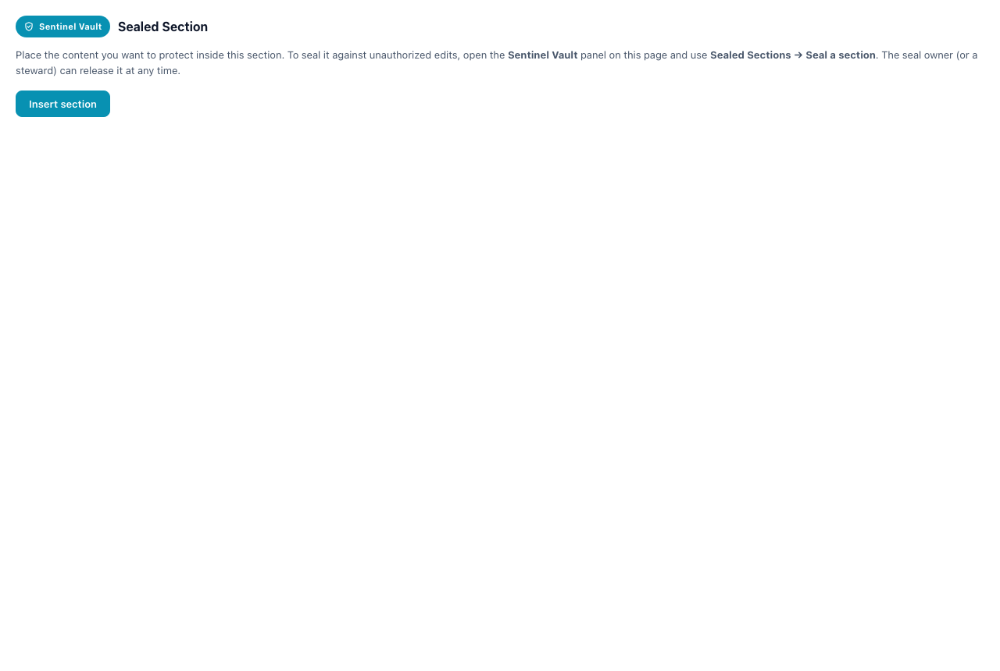

# Content Sealing (section-level)

> Lock a specific section of a Confluence page — a heading and its content — against unauthorized edits, while the rest of the page stays editable.

| | |
|---|---|
| **Surfaces** | Inline panel → *Sealed Sections* · the "Sentinel Vault Sealed Section" macro |
| **Who can use it** | Any editor seals; the **section owner** or a **steward** releases |
| **Status** | Shipped in v4.0.0 |
| **Runs on Atlassian** | Yes (no external egress) |

## What it does

Confluence has no native section-level edit lock, so Sentinel Vault wraps the chosen section in an app-owned **bodied macro** carrying a stable, app-issued `sectionId`, and snapshots its content. If anyone other than the owner edits the body or removes the macro, the page-update trigger detects the drift (via a canonical content hash) and **restores** the sealed content from the snapshot — the same detect-and-restore mechanism already used for sealed attachment embeds. The owner or a steward can release the section at any time, which unwraps it.

## Where to find it

- Open the Sentinel Vault panel → **Sealed Sections** group → **Seal a section** → pick a heading from the page.
- Sealed sections render on the page inside the **"Sentinel Vault Sealed Section"** macro with a "Sealed by … · until …" header.

## How to test — step by step

1. On a page with a few headings, open the panel → **Sealed Sections → Seal a section**.
2. Pick a heading (e.g. "Risks") → it’s wrapped and recorded; the section appears in the **Sealed Sections** list.
3. As a **different** user, edit the text inside that sealed section and save → the change is **restored**.
4. As that user, delete the whole macro and save → the section is **re-inserted**.
5. As the **owner**, edit freely → changes are kept. Click **Unseal** → the section unwraps and becomes editable for everyone.

## What you should see

- A **Sealed Sections** group listing each sealed section (title, expiry; **Unseal** for yours; for a section sealed by someone else, a **Request Edit** button so you can ask the owner for in-place edit access — approved editors’ changes are kept and the seal re-baselines).
- Non-owner edits to the sealed body are reverted; a footer comment notifies the owner.
- A no-op editor save (open and re-save with no real change) does **not** trigger a false revert (canonical-hash comparison).

## Walkthrough — screenshots & video

Inline panel — the **Sealed Sections** group (light + dark):

The "Sealed Section" macro config card:

▶ **Video (seal a section from the picker, in context):** [01-inline-panel-features.mp4](../media/videos/01-inline-panel-features.mp4)
▶ **Video (the macro surface):** [04-sealed-section-macro.mp4](../media/videos/04-sealed-section-macro.mp4)

<video src="../media/videos/01-inline-panel-features.mp4" controls width="900"></video>

## Troubleshooting

- **"No headings to seal"** — the page has no headings; add one and reopen the picker.
- **A legitimate edit was reverted** — the page was edited by a non-owner; the owner can **Unseal**, edit, then re-seal, or use *refresh snapshot* after a sanctioned change. (Canonicalization is hardened against editor re-serialization; see confidence note.)
- **The macro shows a placeholder instead of the body** — the standalone harness can’t reach the Confluence ADF renderer; inside Confluence the body renders normally.

## Under the hood — how it's proven

- **Backend:** `src/server/capsules/section-seals/{logic.js,actions.js}` (seal / unseal / enumerate / snapshot); detect-and-restore pass in the unified `pageContentTrigger` (`src/server/triggers.js`); ADF helpers in `src/server/infra/doc-surgery.js`.
- **Unit tests:** `test/doc-surgery.test.mjs` (19 assertions) covers `canonicalizeAdf` (strips volatile `localId`, key-order independent), `hashAdf` (stable; changes on edit), `computeSectionRange`, `buildSealedSectionNode`/`getSectionId` round-trip, `locateBodiedSectionNodes`, `replaceSectionBody`, `spliceSectionWrapper`.
- **Static checks:** `forge lint` clean; build clean; the bodied macro module deploys (v4.0.0).
- **Live verification:** matrix in [`test-harness/README.md`](../../test-harness/README.md) — seal → non-owner edit restored → macro deletion restored → **no-op save does not false-revert** → owner unseal.
- **Confidence:** MEDIUM-HIGH for the macro-wrapper approach (it reduces section sealing to the already-solved media-restore problem). The flagged area is `canonicalizeAdf` correctness vs the editor’s on-save ADF rewrites — hardened in code and asserted in the unit tests, with a live no-op-save check in the matrix.

---
See also: [Edit Requests](edit-requests.md) · [Conditions & Validations](conditions-validations.md) · [Semantic AI Validations](semantic-ai-validations.md) · [Testing & verification](../TESTING.md)
