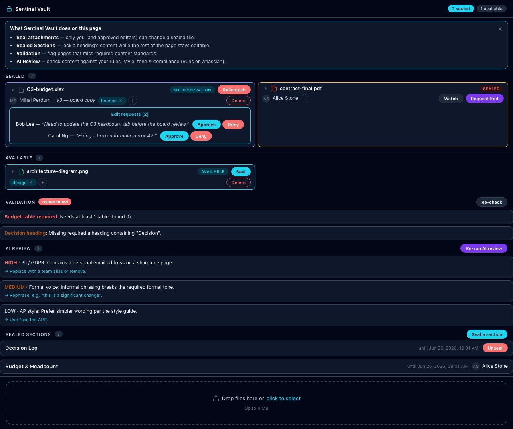
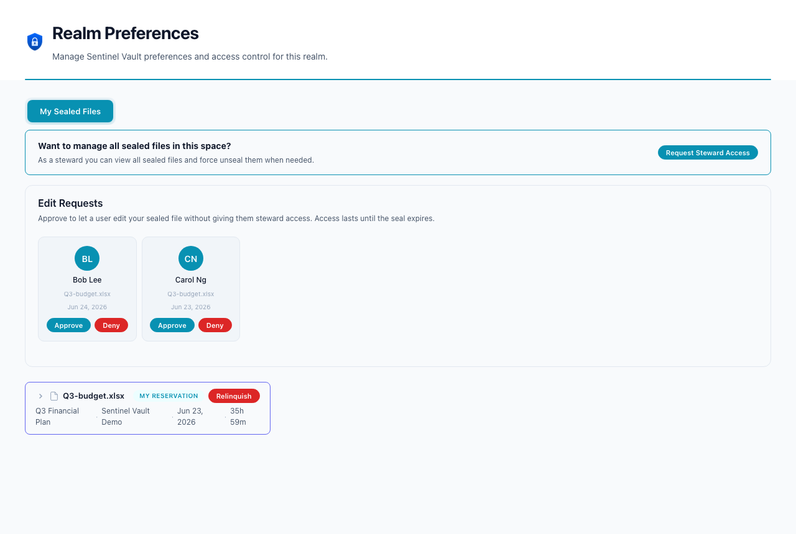

# Edit Requests

> Let approved users edit a sealed attachment without granting them full steward rights — the seal owner approves who can edit.

| | |
|---|---|
| **Surfaces** | Inline panel (request) · Realm console → *My Sealed Files → Edit Requests* (approve) |
| **Who can use it** | Any user can request; the **seal owner** (or a steward) approves |
| **Status** | Shipped in v4.0.0 |
| **Runs on Atlassian** | Yes (no external egress) |

## What it does

When a file is sealed by someone else, a user can **request edit access** instead of asking for full steward permissions. The seal **owner** approves or denies the request. Approved editors can replace/version the file until the seal expires; everyone else is still blocked and auto-reverted. Approvals are scoped to that one attachment and are swept automatically when the seal is released, expires, or the file is deleted.

## Where to find it

- **Request:** open the Sentinel Vault panel on a page → on a file sealed by another user, click **Request Edit** → add an optional **reason** → **Send request**.
- **Approve/deny:** the owner approves in two places — **in the panel itself**, in-place on their sealed file (an "Edit requests (N)" inbox showing each requester’s reason), **or** in **Realm console → My Sealed Files → Edit Requests**.

## How to test — step by step

1. As **User A**, seal an attachment on a page.
2. As **User B**, open the panel → on that file, click **Request Edit** → the button becomes **Requested**.
3. As **User A**, open the space’s Sentinel Vault console → **My Sealed Files → Edit Requests** → click **Approve** on User B’s request.
4. As **User B**, edit/replace the attachment → the change is **kept** (not reverted).
5. As any other user, edit the same file → it is **reverted** (only approved editors are allowed).

## What you should see

- The requester’s button cycles **Request Edit → Requested → Can Edit** (or **Declined**).
- The owner sees an **Edit Requests** card per request with **Approve / Deny**.
- Approved edits persist; the seal silently re-baselines to the new version so later edits by non-editors still revert to the approved content (not the original).
- On unseal/expiry/delete, all grants and requests for that file are cleared.

## Walkthrough — screenshots & video

Requester side — the **Request Edit** button on a file sealed by another user (light + dark):

Owner side — approve **in the panel**, in-place on your sealed file (each request shows the requester’s reason):

…or in the space console:

▶ **Video (owner approves a request):** [03-realm-edit-requests.mp4](../media/videos/03-realm-edit-requests.mp4)
▶ **Video (requester clicks Request Edit, in context):** [01-inline-panel-features.mp4](../media/videos/01-inline-panel-features.mp4)

<video src="../media/videos/03-realm-edit-requests.mp4" controls width="900"></video>

## Troubleshooting

- **No "Request Edit" button** — the file isn’t sealed, or you sealed it yourself (owners already edit freely).
- **"Request already pending" / "declined; try again later"** — one pending request per file; a denied request has a 48-hour cooldown.
- **An approved editor’s change was reverted** — the grant expired with the seal, or it was revoked by the owner/steward.

## Under the hood — how it's proven

- **Backend:** `src/server/capsules/editreq/{actions.js,logic.js}` (request / approve / deny / revoke / grants); the attachment-edit trigger bypass + version/`fileId` re-stamp in `src/server/triggers.js` (`handleSealedArtifactEdit`); grant/request sweeps wired into every seal-teardown site (`sealing/actions.js`, `realms/actions.js`, `sealing/confluence-sync.js`, `triggers.js`).
- **Notifications:** `composeEditRequestLayout` / `composeEditApprovedLayout` / `composeEditDeniedLayout` in `src/server/infra/notice-blueprints.js`.
- **Static checks:** `forge lint` clean; production build clean.
- **Live verification:** see the manual matrix in [`test-harness/README.md`](../../test-harness/README.md) (request → approve → edit-not-reverted → revoke → reverted → unseal sweeps grants), runnable against a deployed dev install.
- **Confidence:** MEDIUM-HIGH — clones the proven steward-request + watch flows; the one subtle area is the trigger re-stamp of `sealedVersion`/`fileId`, covered explicitly in the matrix.

---
See also: [Content Sealing](content-sealing.md) · [Conditions & Validations](conditions-validations.md) · [Semantic AI Validations](semantic-ai-validations.md) · [Testing & verification](../TESTING.md)
