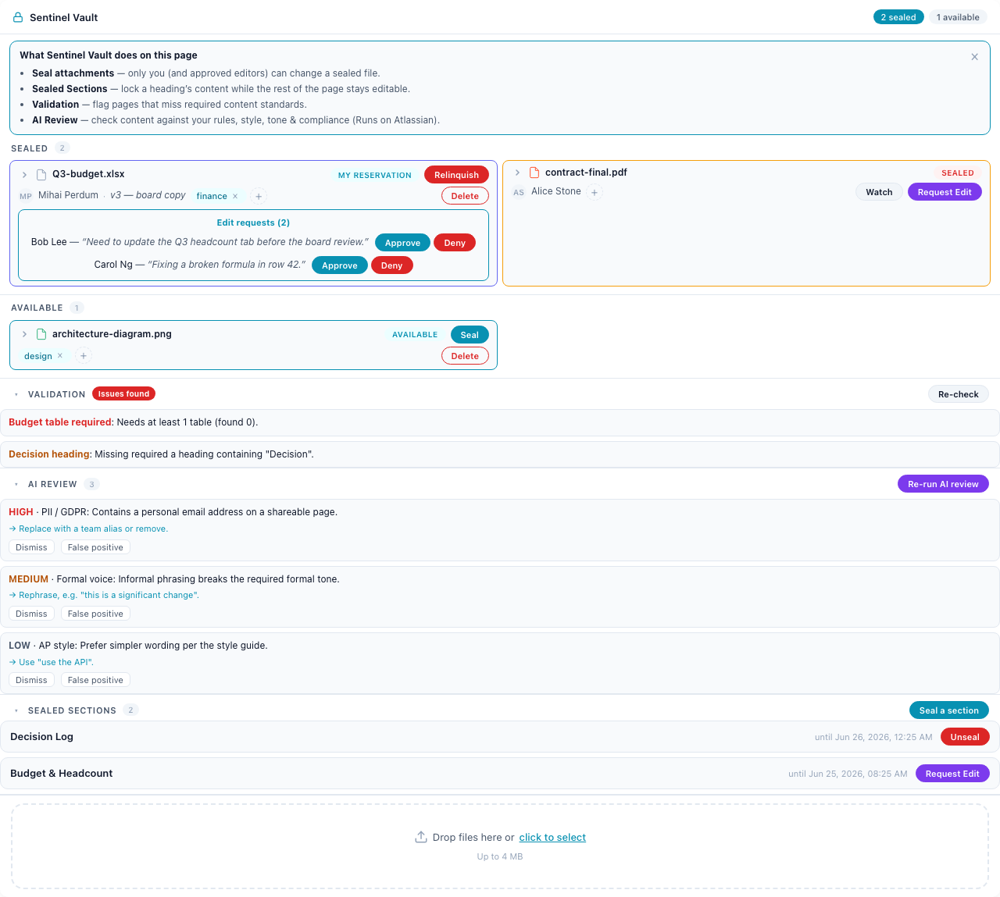
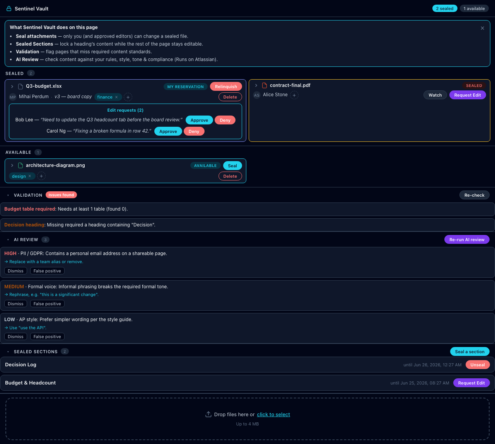
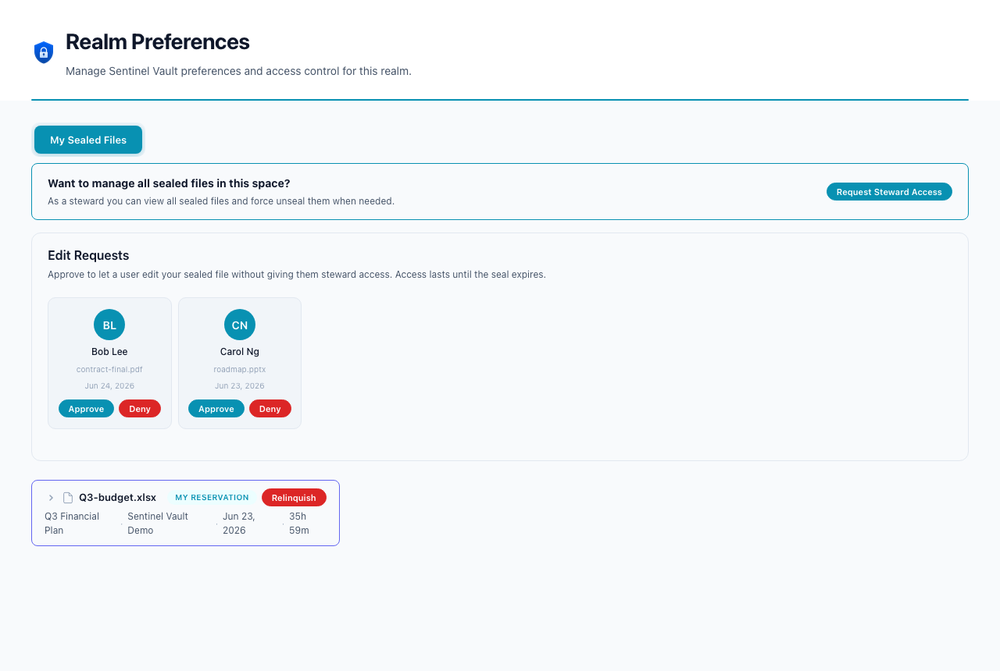

# Edit Requests

> Updated for production 6.5.0. The screenshots and videos below were recorded on 4.x and show older layouts.

> Let approved users edit a sealed attachment without granting them full steward rights — the seal owner approves who can edit.

| | |
|---|---|
| **Surfaces** | Request: page ribbon, page-details modal (Sentinel Vault chip under the title), inline panel · Answer: page-details modal, inline panel, My work, space console |
| **Who can use it** | Any user can request; the **seal owner** answers; the owner, or a space admin while *Allow space admins to force-unseal* is on, can also give access directly |
| **Status** | Shipped since 4.0.0; current in production 6.5.0. Works for sealed files and sealed sections |
| **Runs on Atlassian** | Yes (no external egress) |

## What it does

When a file or section is sealed by someone else, a user can **request edit access** instead of asking for full steward permissions. The seal **owner** approves or denies the request. Approved editors can replace/version the file until the seal expires; everyone else is still blocked and auto-reverted. Approvals are scoped to that one attachment and are swept automatically when the seal is released, expires, or the file is deleted.

## Where to find it

- **Request:** on a file or section sealed by another user, click **Request edit** in the page ribbon, in the page-details modal (Sentinel Vault chip under the page title) or in the inline panel, with an optional reason.
- **Answer:** the owner sees "Waiting for you" on the ribbon and answers **Approve** or **Decline** on the row (page-details modal or panel), on **My work**, or in the space console (where the buttons read **Approve** / **Deny**). Decline can carry a short optional reason for the requester.
- **Give access directly:** the owner (or a space admin, while **Allow space admins to force-unseal** is on) can use **Give edit access…** under the row's ⋯ menu at any time, without a request.
- **Signing:** with the site setting "Sign seal actions with an authenticator code" on, approving, declining, giving and revoking access ask for the current authenticator code.

## How to test — step by step

1. As **User A**, seal an attachment on a page.
2. As **User B**, open the page → click **Request edit** on that file → it shows **Waiting for {owner}**.
3. As **User A**, open the page-details modal or **My work** → **Approve** User B’s request.
4. As **User B**, edit/replace the attachment → the change is **kept** (not reverted).
5. As any other user, edit the same file → it is **reverted** (only approved editors are allowed).

## What you should see

- The requester sees one set of states everywhere: **Waiting for {owner}**, **Edit now · until {time}** once approved, or **Declined · ask again {time}** (with the owner's reason, if given). **My work → Your edit requests** lists them.
- The owner sees each request with **Approve / Decline**.
- Approved edits persist; the seal silently re-baselines to the new version so later edits by non-editors still revert to the approved content (not the original).
- On unseal/expiry/delete, all grants and requests for that file are cleared.

## Walkthrough — screenshots & video

Requester side — the **Request Edit** button on a file sealed by another user (light + dark):

Owner side — approve **in the panel**, in-place on your sealed file (each request shows the requester’s reason):

…or in the space console:

▶ **Video (owner approves a request):** [03-realm-edit-requests.mp4](../media/videos/03-realm-edit-requests.mp4)
▶ **Video (requester clicks Request Edit, in context):** [01-inline-panel-features.mp4](../media/videos/01-inline-panel-features.mp4)

<video src="../media/videos/03-realm-edit-requests.mp4" controls width="900"></video>

## Troubleshooting

- **No "Request edit" button** — the file isn’t sealed, or you sealed it yourself (owners already edit freely).
- **"Request already pending" / Declined · ask again {time}** — one pending request per file or section. After a decline the same person waits the site's **Hours before a declined edit request can be repeated** (`editRequestCooldownHours`, default 1 hour, 0 = no wait, maximum 168). The owner can still give access directly.
- **An approved editor’s change was reverted** — the grant expired with the seal, or it was revoked by the owner or a space admin.

## Under the hood — how it's proven

- **Backend:** `src/server/capsules/editreq/{actions.js,logic.js}` (request / approve / deny / revoke / grants); the attachment-edit trigger bypass + version/`fileId` re-stamp in `src/server/triggers.js` (`handleSealedArtifactEdit`); grant/request sweeps wired into every seal-teardown site (`sealing/actions.js`, `realms/actions.js`, `sealing/confluence-sync.js`, `triggers.js`).
- **Notifications:** `composeEditRequestLayout` / `composeEditApprovedLayout` / `composeEditDeniedLayout` in `src/server/infra/notice-blueprints.js`.
- **Static checks:** `forge lint` clean; production build clean.
- **Live verification:** see the manual matrix in [`test-harness/README.md`](../../test-harness/README.md) (request → approve → edit-not-reverted → revoke → reverted → unseal sweeps grants), runnable against a deployed dev install.
- **Confidence:** MEDIUM-HIGH — clones the proven steward-request + watch flows; the one subtle area is the trigger re-stamp of `sealedVersion`/`fileId`, covered explicitly in the matrix.

---
See also: [Content Sealing](content-sealing.md) · [Conditions & Validations](conditions-validations.md) · [Semantic AI Validations](semantic-ai-validations.md) · [Testing & verification](../TESTING.md)
